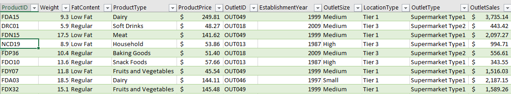
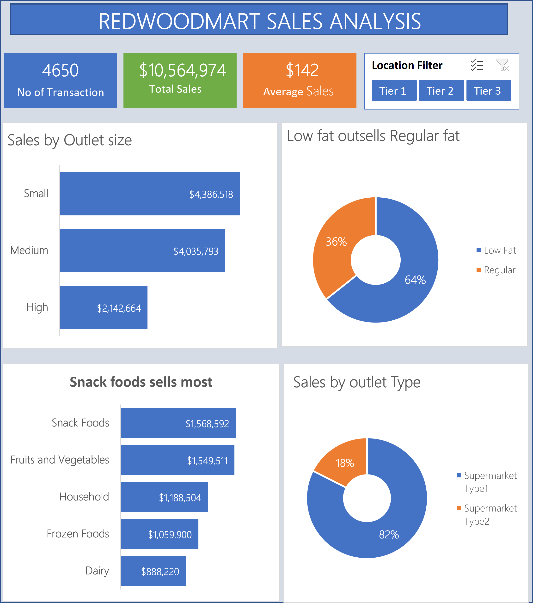

# Redwood Mart Sales Analysis Report

## Executive Summary
This analysis was carried out to evaluate Redwood Mart Sales performance. It gives insight into their Key Performance Indicators like total transaction, total sales and average price. It also gives insights into their sales by outlet size, sales by their product fat content, sales by product type and sales by outlet type.

## Business Context
Redwood Mart  management is seeking a data-driven view of sales performance to better understand product trends, customer preferences, and store-level dynamics. The goal of the project is intended to provide actionable insights that will guide strategic decisions on product mix, outlet optimization, and pricing strategies.

## Objectives
The objectives of the analysis are to answer the following business questions :
- Which Product types generate the highest sales?
- Do low-fat products sell better than regular-fat products?
- How does outlet-size (small, medium, high) affect sales?
- Which outlet contribute the most to total sale?

## Data Overview
The analysis is based on a consolidated dataset of 4651 transactions and 11  columns. It is a record of all the sales done by Redwood Mart across their outlets.

## Data Preview

## Key Findings
- The total transaction done by redwood mart across all outlet is 4651.
- The small outlets generally contribute more to sales.
- Low fat products outsells the regular fat products.
- Snack foods are the best selling product type.
- Supermarket 1 contributes most to sales.
- The average price of products is $142.

## Dashboard 

## Data Cleaning And Transformation
- Empty rows were removed from the weight column.
- ‘Reg’ was replaced by the appropriate Regular in the fat content column.
- ‘LF’ was replaced by the appropriate ‘Low fat’ in the fat content.
- S, M and H were replaced with small, Medium and High in the outlet size column.

